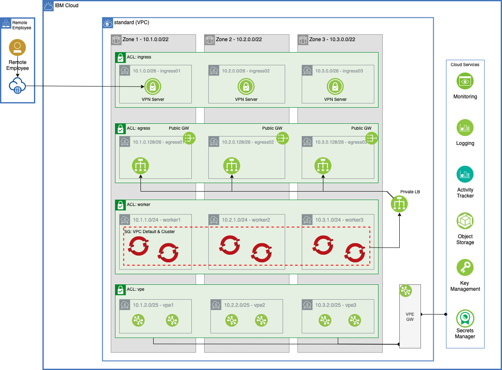

# IBM Cloud Standard Reference Architecture

Automation to provision the Standard architecture on IBM Cloud. This architecture provides an environment suitable for production workloads on a single OpenShift cluster.

## Reference Architecture



<table>
    <thead>
        <tr>
            <th>Layer name</th>
            <th>Layer description</th>
            <th>Provided resources</th>
        </tr>
    </thead>
    <tbody>
        <tr>
            <td>000 - Account Setup</td>
            <td>This layer sets up the account for a secure cluster configuration</td>
            <td>
                <h4>Shared Services</h4>
                <ul>
                    <li>IAM settings</li>
                </ul>
            </td>
        </tr>
        <tr>
            <td>100 - Shared Services</td>
            <td>This layer provisions the shared services</td>
            <td>
                <h4>Shared Services</h4>
                <ul>
                    <li>Flow Logs</li>
                    <li>Activity Tracker</li>
                    <li>Cloud Object Storage (COS)</li>
                    <li>Object Storage Encryption</li>
                    <li>Certificate Manager</li>
                    <li>Key Management Service</li>
                    <li>VSI Encryption Setup</li>
                    <li>IBM Log Analysis</li>
                    <li>IBM Cloud Monitoring</li>
                </ul>
            </td>
        </tr>
        <tr>
            <td>110 - Edge VPC</td>
            <td>This layer provisions the VPC to contain the cluster</td>
            <td>
                <h4>Network</h4>
                <ul>
                    <li>Virtual Private Cloud (VPC)</li>
                    <li>VPC Gateways</li>
                    <li>Egress subnets</li>
                    <li>Ingress subnets</li>
                    <li>VPN Server</li>
                </ul>
            </td>
        </tr>
        <tr>
            <td>115 - IBM VPC OpenShift Standard</td>
            <td>This layer provisions the OpenShift cluster within the Edge VPC created earlier</td>
            <td>
                <h4>Network</h4>
                <ul>
                    <li>VPE Subnets and Gateway</li>
                    <li>Worker Subnets</li>
                    <li>Red Hat OpenShift cluster</li>
                </ul>
                <h4>Shared Services</h4>
                <ul>
                    <li>Keyprotect Encryption</li>
                </ul>
            </td>
        </tr>
        <tr>
            <td>200 - IBM OpenShift Gitops</td>
            <td>This layer provisions OpenShift CI/CD tools into the cluster, a GitOps repository, and bootstraps the
                repository to the OpenShift Gitops instance.</td>
            <td>
                <h4>Software</h4>
                <ul>
                    <li>OpenShift GitOps (ArgoCD)</li>
                    <li>OpenShift Pipelines (Tekton)</li>
                    <li>Sealed Secrets (Kubeseal)</li>
                    <li>GitOps repo</li>
                </ul>
            </td>
        </tr>
        <tr>
            <td>205 - IBM Storage</td>
            <td>The storage layer offers two options: `odf` and `none` (default). Either odf or default storage can be
                installed.</td>
            <td>
                <h4>ODF Storage</h4>
                <ul>
                    <li>ODF operator</li>
                    <li>ODF storage classes</li>
                </ul>
            </td>
        </tr>
        <tr>
            <td>220 - Dev Tools</td>
            <td>The dev tools layer installs standard continuous integration (CI) pipelines that integrate with tools
                that support the software development lifecycle.</td>
            <td>
                <h4>Software</h4>
                <ul>
                    <li>Artifactory</li>
                    <li>Developer Dashboard</li>
                    <li>Pact Broker</li>
                    <li>Sonarqube</li>
                    <li>Tekton Resources</li>
                </ul>
            </td>
        </tr>
    </tbody>
</table>

## Automation Stages

### Prerequisites

1. Have access to an IBM Cloud Account. An Enterprise account is best for workload isolation but this terraform can be run in a Pay Go account as well.

2. (Optional) Install and start Colima to run the terraform tools in a local bootstrapped container image.

    ```shell
    brew install docker colima
    colima start
    ```

### Setup

1. Clone this repository to your local SRE laptop or into a secure terminal. Open a shell into the cloned directory.
2. Copy **credentials.template** to **credentials.properties**.
    ```shell
    cp credentials.template credentials.properties
    ```
3. Provide values for the variables in **credentials.properties** (**Note:** `*.properties` has been added to **.gitignore** to ensure that the file containing the apikey cannot be checked into Git.)
   - **TF_VAR_ibmcloud_api_key** - The API key for the IBM Cloud account where the infrastructure will be provisioned.
   - **TF_VAR_gitops_repo_host** - (Optional) The host for the git repository (e.g. github.com, bitbucket.org). Supported Git servers are GitHub, Github Enterprise, Gitlab, Bitbucket, Azure DevOps, and Gitea. If this value is left commented out, the automation will default to using Gitea.
   - **TF_VAR_gitops_repo_username** - The username on git server host that will be used to provision and access the gitops repository. If the `gitops_repo_host` is blank this value will be ignored and the Gitea credentials will be used.
   - **TF_VAR_gitops_repo_token** - The personal access token that will be used to authenticate to the git server to provision and access the gitops repository. (The user should have necessary access in the org to create the repository and the token should have `delete_repo` permission.) If the host is blank this value will be ignored and the Gitea credentials will be used.
   - **TF_VAR_gitops_repo_org** - (Optional) The organization/owner/group on the git server where the gitops repository will be provisioned/found. If not provided the org will default to the username.
   - **TF_VAR_gitops_repo_project** - (Optional) The project on the Azure DevOps server where the gitops repository will be provisioned/found. This value is only required for repositories on Azure DevOps.

4. Run **./launch.sh**. This will start a container image with the prompt opened in the `/terraform` directory, pointed to the repo directory.
5. Create a working copy of the terraform by running **./setup-workspace.sh**. The script makes a copy of the terraform in `/workspaces/current` and set up "cluster.tfvars" and "gitops.tfvars" files populated with default values. The **setup-workspace.sh** script has a number of optional arguments.

    ```
    Usage: setup-workspace.sh [-f FLAVOR] -s STORAGE [-n PREFIX_NAME] [-r REGION] [-g GIT_HOST]
    options:
     -f   (optional) the flavor to use (quickstart)
     -s   the storage option to use (none or odf)
     -n   (optional) prefix that should be used for all variables
     -r   (optional) the region where the infrastructure will be provisioned
     -g   (optional) the git host that will be used for the gitops repo. If left blank gitea will be used by default. (Github, Github Enterprise, Gitlab, Bitbucket, Azure DevOps, and Gitea servers are supported)
     -h   Print this help
    ```

6. Change the directory to the current workspace where the automation was configured (e.g. `/workspaces/current`).
7. Inspect **cluster.tfvars** to see if there are any variables that should be changed. (The **setup-workspace.sh** script has generated **cluster.tfvars** with default values and can be used without updates, if desired.)

#### Run all the Terraform layers automatically

From the **/workspace/current** directory, run the following:

```shell
./apply-all.sh
```

The script will run through each of the terraform layers in sequence to provision the entire infrastructure.

#### Run all the Terraform layers manually

From the **/workspace/current** directory, run change directory into each of the layer subdirectories and run the following:

```shell
cd <directory_name>
./apply.sh
```