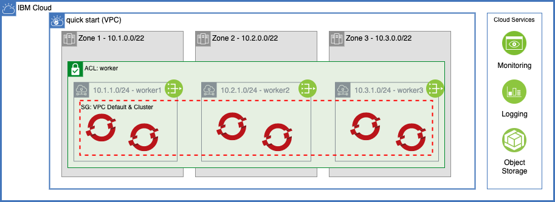

# IBM Cloud Reference Architecture - Automation

> This collection of IBM Cloud terraform automation bundles has been crafted from a set of [Terraform modules](https://modules.cloudnativetoolkit.dev/) created by the IBM Ecosystem Labs team part of the [IBM Ecosystem organization](https://www.ibm.com/partnerworld/public?mhsrc=ibmsearch_a&mhq=partnerworld). Please contact **Matthew Perrins** __mjperrin@us.ibm.com__, **Sean Sundberg** __seansund@us.ibm.com__, or **Andrew Trice** __amtrice@us.ibm.com__ for more details or raise an issue on the [repository](https://github.com/cloud-native-toolkit/software-everywhere) for bugs or feature requests.

Three different flavors of the reference architecture are provided with different levels of complexity.

- QuickStart - minimum to get OpenShift with public endpoints running on basic VPC + Subnet with ROKS
- Standard - a simple robust architecture that can support a production workload in a single VPC with a VPN+Private Endpoints and a ROKS cluster
- Advanced - a sophisticated architecture isolating DMZs, Development and Production VPCs for best practices

## Reference architectures

This set of automation packages was generated using the open-source [`isacable`](https://github.com/cloud-native-toolkit/iascable) tool. This tool enables a [Bill of Material yaml](https://github.com/cloud-native-toolkit/automation-solutions/tree/main/boms) file to describe your IBM Cloud architecture, which it then generates the terraform modules into a package of infrastructure as code that you can use to accelerate the configuration of your IBM Cloud environment. Iascable generates standard terraform templates that can be executed from any terraform environment.

> The `iascable` tool is targeted for use by advanced SRE developers. It requires deep knowledge of how the modules plug together into a customized architecture. This repository is a fully tested output from that tool. This makes it ready to consume for projects.

### Quick Start



### Standard

TBD

### Advanced

TBD

## Automation

### Prerequisites

1. Have access to an IBM Cloud Account. An Enterprise account is best for workload isolation but this terraform can be run in a Pay Go account as well.

2. (Optional) Install and start Colima to run the terraform tools in a local bootstrapped container image.

    ```shell
    brew install docker colima
    colima start
    ```

### Planning

1. Determine which flavor of reference architecture you will provision: Quick Start, Standard, or Advanced.
2. View the README in the automation directory for detailed instructions for installation steps and required information:
    - [Quick Start](automation/1-quickstart)
    - [Standard](automation/2-standard)
    - [Advanced](automation/3-advanced)

### Setup

1. Clone this repository to your local SRE laptop or into a secure terminal. Open a shell into the cloned directory.
2. Copy `credentials.template` to `credentials.properties`.
3. Provide your IBM Cloud API key as the value for the `TF_VAR_ibmcloud_api_key` variable in `credentials.properties` (**Note:** `*.properties` has been added to `.gitignore` to ensure that the file containing the apikey cannot be checked into Git.)
4. Run `./launch.sh`. This will start a container image with the prompt opened in the `/terraform` directory.
5. Create a working copy of the terraform by running `./setup-workspace.sh`. The script makes a copy of the terraform in `/workspaces/current` and set up an empty `terraform.tfvars` file.
6. Change the directory to the subdirectory for the layer (e.g. `/workspaces/current`) and follow the instructions in the README for the layer.
