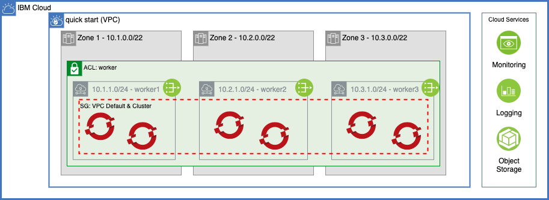

# IBM Cloud Quick Start Reference Architecture

Automation to provision the Quick Start reference architecture on IBM Cloud. The architecture implements the minimum infrastructure required to stand up a managed Red Hat OpenShift cluster with public endpoints.

## Reference Architecture

### Network

- VPC network
- VPC Subnet
- VPC Public Gateways
- Red Hat OpenShift cluster

### Shared Services

- Object Storage
- IBM Log Analysis
- IBM Cloud Monitoring

### Software

- OpenShift GitOps (ArgoCD)
- OpenShift Pipelines (Tekton)
- KubeSeal
- GitOps repo

## Automation

#### Running the automation

1. Run `1-quickstart/110-vpc-openshift/apply.sh`
2. The script will prompt for variables that must be provided for the script. Alternatively, the values can be provided in a file named `variables.yaml`. An example yaml file has been provided in `variables.template.yaml`.

| Variable               | Description                                                            |
|------------------------|------------------------------------------------------------------------|
| resource_group_name    | The name of the resource group where the resources will be provisioned |
| region                 | The region where the resources will be provisioned                     |
| ibm-vpc-subnets__count | The number of subnets to provision for the cluster                     |
| worker_count           | The number of worker nodes that should be provisioned in each subnet   |
| cluster_flavor         | The machine type that will be used for the cluster                     |
| gitops-repo_host       | The host of the gitops repo (e.g. github.com)                          |
| gitops-repo_type       | The type of the gitops repo (e.g. github)                              |
| gitops-repo_org        | The existing org/group where the gitops repo will be created/found     |
| gitops-repo_repo       | The name for the gitops repo                                           |
| gitops-repo_username   | The username that will be used to access the gitops repo               |
| gitops-repo_token      | The personal access token that will be used to access the gitops repo  |

3. When the script runs, all of the provided values will be written to ta file named `variables.yaml` and the terraform will be applied.

